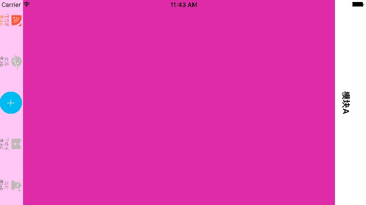

## DeviceOrientationDemo

## Contents 
That's a demo about how to change orientation of the iPhone smoothly

This repo focus on usage of:

* Orientation rotation
* Basic Project Structure
* Custom Button on TabBar
* Using Block 
* Simple App Icon

## Tips

> 屏幕旋转的整个流程是如下

1. 当 当前设备方向属性`orientation` 发生变化时候，会调用`Controller` 的`shouldAutorotate` 属性。
2. 如果`shouldAutorotate` 为`true` 则会进一步调用`supportedInterfaceOrientations` 来查询支持的屏幕方向。
3. 当`Controller` 支持的方向和设备方向一致时候就进行旋转操作。

## Bugs

* 横屏时使用`UIAlertController`会导致该错误，解决方法：添加`UIAlertController`的`category` 重写`- (BOOL)shouldAutorotate`方法

```
//UIApplicationInvalidInterfaceOrientation
Supported orientations has no common orientation with the application, 
and [UIAlertController shouldAutorotate] is returning YES
```

* 横屏进入首页时的一个Bug (打开了锁屏开关,不锁屏)



## Reference

[1> iOS 开发技巧 - 手动控制屏幕UI方向](https://eliyar.biz/ios-manual-change-screen-orientation/)

[2> 如何用代码控制以不同屏幕方向打开新页面](https://lvwenhan.com/ios/458.html)


## Reach Me ##

I am an iOS developer and currently learning Swift.

Weibo: [@manajay](http://weibo.com/manajay)
Twitter: [@manajay](https://twitter.com/Manajay_dlj)


